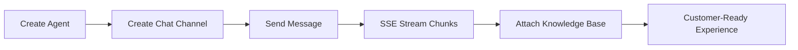

# AI Sandbox SDK for Go


## UX-First Value Cards

| Quick Integration | Real-Time Experience | Reliability by Default |
| --- | --- | --- |
| Lightweight client for low-overhead service integration | SSE streaming via `SendChatStream(...)` | Retry + timeout controls for stable operations |

## Visual Integration Flow



## 60-Second Quick Start

```go
package main

import (
  "fmt"
  "os"

  aisandboxsdk "github.com/eGroupAI/ai-sandbox-sdk-go"
)

func main() {
  client := aisandboxsdk.NewClient(
    getenv("AI_SANDBOX_BASE_URL", "https://www.egroupai.com"),
    os.Getenv("AI_SANDBOX_API_KEY"),
  )

  agent, _ := client.CreateAgent(map[string]any{
    "agentDisplayName": "Support Agent",
    "agentDescription": "Handles customer inquiries",
  })
  agentID := int(agent["payload"].(map[string]any)["agentId"].(float64))

  channel, _ := client.CreateChatChannel(agentID, map[string]any{
    "title": "Web Chat",
    "visitorId": "visitor-001",
  })
  channelID := channel["payload"].(map[string]any)["channelId"].(string)

  chunks, _ := client.SendChatStream(agentID, map[string]any{
    "channelId": channelID,
    "message": "What is the return policy?",
    "stream": true,
  })
  fmt.Println(chunks)
}

func getenv(key, fallback string) string {
  if v, ok := os.LookupEnv(key); ok {
    return v
  }
  return fallback
}
```

## Installation

```bash
go get github.com/eGroupAI/ai-sandbox-sdk-go
```

## Snapshot

| Metric | Value |
| --- | --- |
| API Coverage | 11 operations (Agent / Chat / Knowledge Base) |
| Stream Mode | `text/event-stream` with `[DONE]` handling |
| Retry Safety | 429/5xx auto-retry for GET/HEAD + capped exponential backoff |
| Error Surface | `ApiError` with status/body/traceId |
| Validation | Production-host integration verified |

## Links

- [Official System Integration Docs](https://www.egroupai.com/ai-sandbox/system-integration)
- [30-Day Optimization Plan](docs/30D_OPTIMIZATION_PLAN.md)
- [Integration Guide](docs/INTEGRATION.md)
- [Quickstart Example](examples/quickstart/main.go)
- [Repository](https://github.com/eGroupAI/ai-sandbox-sdk-go)

## License

This SDK is released under the Apache-2.0 license.
